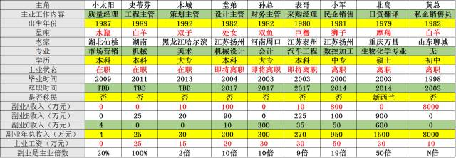
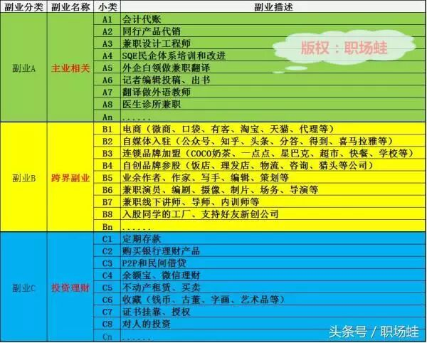

**写在前面：**打工，能否是实现财务自由？我们来做个调查，请您参与一下。

打工，能否实现财务自由？ 

|多选| | |
|--|--|--|
|打工，绝对能实现财务自由！|52票 |6%  |
|打工，不可能实现财务自由！|209票| 24%|
|通过适当努力和方法运用，少部分可实现。|458票 |52%|
|扯淡！|155票| 18%|

顺便看看其他人的看法，也许你不够努力，也许你方向已经错了好多年！

本篇是“打工能否实现财务自由”系列八部曲的第7篇（**前面6篇您可以点击如下链接查看**）：

> 1. [开篇：打工，能否实现财务自由？(1/8)](http://mp.weixin.qq.com/s?__biz=MzI0MzQ0OTUxOA==&mid=2247484239&idx=1&sn=7d827c200ea09c3123682049ef05254f&chksm=e96da88ede1a2198df403c40bd413758c7b4d33ed1faba94a51ba5ca4ce4bbfb77582acea708&scene=21#wechat_redirect)
> 2. [突破口：打工，能否实现财务自由？(2/8)](http://mp.weixin.qq.com/s?__biz=MzI0MzQ0OTUxOA==&mid=2247484241&idx=1&sn=91677f595ae357a0c731b39f62557e50&chksm=e96da890de1a2186907c97ac688ca71bcd19eed3c2daa33cee8766da10c9697bc8970f2a33e7&scene=21#wechat_redirect)
> 3. [副业分类：打工，能否实现财务自由？(3/8)](http://mp.weixin.qq.com/s?__biz=MzI0MzQ0OTUxOA==&mid=2247484253&idx=1&sn=4a1bd251a05afe37a1d0d212bbe26541&chksm=e96da89cde1a218af809092ded3878eed701ca5cab2d027038cb668fd9d89f0fa0f8f185c678&scene=21#wechat_redirect)
> 4. [你的样子：打工，能否实现财务自由？(4/8)](http://mp.weixin.qq.com/s?__biz=MzI0MzQ0OTUxOA==&mid=2247484254&idx=1&sn=f97980c43b203153027990e0ef0de3ed&chksm=e96da89fde1a218954e2ed3dea7a7363fef4b50b3895a8058d6a46a3462ca6a432aa2ebd9d71&scene=21#wechat_redirect)
> 5. [副业是工资十倍：打工，能否实现财务自由？(5/8)](http://mp.weixin.qq.com/s?__biz=MzI0MzQ0OTUxOA==&mid=2247484257&idx=1&sn=61f387ab869e7b873e9e77598ba55683&chksm=e96da8a0de1a21b6a1691342653932f19dfc663b51d5372b674d38621f84b37dc7bb15823d1d&scene=21#wechat_redirect)
> 6. [副业如何成为主业：打工，能否实现财务自由？(6/8)](http://mp.weixin.qq.com/s?__biz=MzI0MzQ0OTUxOA==&mid=2247484260&idx=1&sn=c74868cd0ad5fbc16efdc10170cdb258&chksm=e96da8a5de1a21b30ef228090d67e17118770ea5e6aed22fdd71e67a856c2b1dd787eadcd18e&scene=21#wechat_redirect)
> 7. **什么人适合副业：打工，能否实现财务自由？(7/8)**
> 8. 手把手教你：打工，能否实现财务自由？（8/8）

本文的目的是，在花5分钟认真看完规律总结之后，您可以大致勾勒出自己的财务自由路线图，并列出适合自己的副业清单。

总结之前的9个重点真实案例，到了大团聚的时候了。

> * a）大城市之小太阳
> * b）大V之史蒂芬
> * c）设计之木导
> * d）机械专业之堂弟
> * e）房姐之孙总
> * f）过犹不及之表哥
> * g）中专生之小军
> * h）硕士逆袭之北岛
> * i）黄总为生意而生

尽管不是完全随意抓取的这几个真实案例，但还是有一定的代表性的。他山之石可以攻玉，我们将他们汇总如下表。

你也趁此总结下你的副业之道。正常来说，根据一份工作简历，很快就可以写出自己的副业路线图。

我们来认真分析，并从前文提取下副业发展的规律，从这张表中，对于副业的相关规律如果我还没发现，请大家在留言中指正。

> * 主业工作内容：俩销售，一采购，一工程，一质量，一财务，一翻译，一设计，一策划，整体来说，无论文科还是理科，都可以发展副业，销售、采购、财务更容易做出突出的副业。
> * 出生年份：70后80初，是副业发达的主要人群，其次是90前后，而85前后不多且这“小太阳”非副业成功案例。
> * 星座：白羊也许相对适合创业，其他以及未上表的不一定不适合发展副业，星座规律在这里不明显。
> * 老家来处：来自全国各地，江苏偏多，但都是在大城市发展，这可能跟作者本人的老家和待在上海有关，所以这条作为参考，应该副业发展更适合在大城市，跟老家在哪里等其他因素无关。
> * **所学专业**：关系不大，啥专业都有，说明啥专业都可以在工作中开发副业。
> * 学历：跟副业发展也没多大关系，相比较而言，低学历发展副业的成本更低，更加义无反顾。
> * 毕业时间跟工作辞职时间：这跟副业收入的多寡相关，总体而言，还是副业赚得越多，辞职越早。也许中国人比较保守，这里好几个人副业达到或者接近主业收入的10倍时，辞职才提上了日程。
> * 移民：只有一个学历高的移民了，当然也要看收入是否能支撑，无疑，年收入超过1000万后，移民比例会提高。
> * **副业是主业倍数**：我们的案例中大多数是，副业是主业好多倍，是副业成功案例，现实中，绝大多数人应该是“小太阳”那样的比例，比方一年工资8万，副业收入不到2万。

以上所有案例全部来自真人真事，想分别探讨，或者欲取得联系方式的，可私信小编。

理论上人人都能实现副业发展，可以通过你的简历就写出你适合的副业路线图，相信你自己已经有谱了。

# 1，财务自由的标准如何制定？工资外收入大于工资，就是财务自由吗？

我们不考虑国外的理财实现财务自由的理论，而是根据国内实际情况，得出规律：**工资外收入＞工资不是财务自由，得≥3倍工资，且稳定，才是财务自由**，这是综合评估的标准。

财务自由，一般指相对财务自由，而不是绝对的。资产多了之后，你打理这份财富的心思和精力，也会让你不自由，所以财务自由在国内是相对的。

如上，在我们的九大案例中，从“堂弟”开始，往右的6位同仁这样的人，算作相对财务自由了。

---

# 2，什么是副业？如何分类？微信收到红包，算不算副业？

正常来说，工资外的稳定收入，就是副业，见如下副业总表。这三种副业分类，你可以逐个开发。

大家注意下，偶然性收入，不是副业。什么是偶然性收入呢？比如红包、中奖、炒股、投机、赠与、感谢费，等。强调一下，红包不是副业；炒股也不是副业！

副业总表

---

# 3，什么人适合发展副业？毕业几年适合开拓副业？

> * 如果你的工作稳定，比如在公务机关、国有企事业单位，大致在毕业第2年时，可以开拓副业；
> * 如果你在其他单位，比如中、小、大型私企民企，合资、外资等三资企业，则需要主业工资接近同龄人当地水平两倍，大致在毕业前5年，可以开拓副业。

无论什么年龄、专业、行业、星座、血型、长相、身高、体重、内向外向、家庭背景，都适合发展副业。

---

# 4，我是应届生，才大专毕业，还有机会实现财务自由吗？

**有机会，但，这是一个循序渐进的过程。如下四步，越早越好。**

> 第一步，工资达到同龄人两倍，或者工作稳定（**毕业0-5年**）；
> 
> 第二步，开拓三种副业中适合自己的部分，先列出，再淘汰，然后开发，接着发展，超过工资（**毕业5-10年**）；
> 
> 第三步，实现副业稳定，超过主业3倍（**毕业10-15年**）；
> 
> 第四步，副业超过主业8倍以上（**毕业15年后**）。

---

# 5，什么人适合直接创业？

如下三者，满足其一即可：

> **1，学历较低；****2，年收入低于当地平均工资；**
> 
> **3，能直接借到或者融资达到100万元人民币。**

我们每个人身边，都有不少能满足第一点的人，他们都是副业壮大的典型，甚至有从餐饮行业也就是饭店端盘子做服务生开始，后来跨行做销售跟单，最后发展自己的副业成主业，成为企业家的，尽管他们学历不高。

---

# 6，没能圈到A轮融资，如何创业？除了互联网APP这种，其他就不能创业了吗？

我们总结各行各业各种成功规律，推荐如下次序：

> * **先进入B2B市场（企业内客户代表/主管/经理、大客户经理、项目经理等）；**
> * **接着C2C市场（比如淘宝、微店、直销、微商等）；**
> * **然后B2C（入驻天猫、亚马逊、京东、自媒体平台、保险、理财、生产自有产品，等）；**
> * **最后C2B市场（共享单车、创客空间、APP开发、实体销售，等）。**

---

# 7，我在职，能注册公司不？单位会查我不？

全民创业是个大好时机，到了我们具体某一个人身上，**在副业跟公司主业相关的情况下，则需要向公司提交书面披露报告；不相关，则无需披露**。

---

8，主业之外，我可以开拓哪些副业？

前文中的副业汇总表，你可以时不时拿出来看一下，琢磨琢磨。

这三大副业，你看看哪些可以在你的主业之余发展发展：**跟主业相关的副业A；跟主业不相关的跨界副业B；投资理财副业C。**

---

# 9，发展副业有哪几个重要的时间节点？

根据上千个现实中的副业成功者统计案例，我们总结出三个重要时间节点：

> **第一个时间节点，副业选型；**
> 
> **第二个时间节点，副业年收入超过工资；**
> 
> **第三个时间节点，副业稳定并达到工资3倍。**

---

# 10，哪些行业前景看好？可以发展副业，可以创业。

我们总结了2大类前景看好的行业，您可以认真保存，收藏，点赞，或者转发给需要的好友。

**第一类：传统制造业的革新部门。**

> **1，柔性制造的设备行业；**
> 
> **2，工业自动化；**
> 
> **3，机器人和人工智能；**
> 
> **4，环保；**
> 
> **5，小批量定制化服务型企业；**
> 
> **6，自动驾驶产业；**
> 
> **7，新能源行业；**
> 
> **8，智能交通。**

**第二类：服务业的快速增加部门。**

> **A，看病（医疗、医药、诊所、医院）；**
> 
> **B，延寿（健身、保养）；**
> 
> **C，娱乐（餐饮、咖啡、聚会、电影、农家乐、旅游旅行、出国需求）；**
> 
> **D，爱美之心（美容、美发、整形）；**
> 
> **E，下一代（教育、培训、充电、技能、咨询、代孕、领养）；**
> 
> **F，延年益寿（养生、心理咨询、养老）；**
> 
> **G，懒惰（快递、洗衣店、上门服务、保姆家政、汽车维保、个性装潢）**。

以上十大问题，是我们发展副业，最需要解决的。

希望您通过研读，可以总结适合自己的副业之道。下篇，进入我们最后一篇，财务自由总结篇的冲刺阶段--“**手把手教你如何实现财务自由**”。很快您就毕业了，可以走上财务自由的康庄大道了。

End

---

