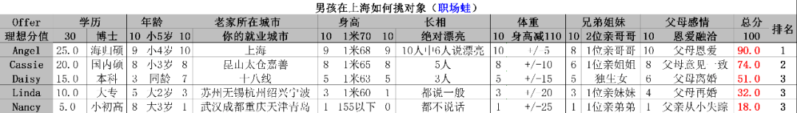

本篇实际上应该是周末或节假日发的，但最近太多人来问了，拿着我的打分表问**ABC三个男朋友挑哪个好**、要么**小张小王一个分数高一个感情好不知嫁给谁**、女孩家里一个哥哥一个姐姐能不能谈......

本文给出最终的解答。

我说过多次，**找工作**和**找对象**，不可完全类比，更不能套用。

我们先看找工作如何判断。

**应届生和毕业不久的人，用如下表格。**

一份工作，也就是打工，关乎实实在在的收入，也关乎工作制下省出来的私人时间、到老家的距离、未来的跳槽和副业空间，当然能尽量考虑到不裁员、注册年数稍微多一点、人数多、制度健全的公司。

**毕业3年后的往届生**，因为行业烙印开始加深，所以要加入公司主营业务这个考虑项，并降低工资在总权重里的份额。

但是，仍然不能考虑过多的感情因素，比如“我喜欢这个行业”“这是我心仪的公司”“领导好”“公司环境不错”“公司能介绍对象”“还有下午茶”“同学/前同事在这里上班”“亲戚的公司”......资本家给你降薪、降职、裁员时，**从来不会跟你讲感情。**

不能讲感情，几乎在任何事业发展里，感情都是一个极其不稳定的因素，是让那些“之前混得不错”的人突然混不下去的主要原因。

感情用在事业里，无论你是对一份工作执着的喜欢，还是对一个行业彻底的厌恶，都不要掺入进你具体的工作中去。

你可能还不明白《赌王》里面讲的“六亲不认”为何是赌术的最高境界，但我告诉你，之前我也举例过一次，武则天可是将自己众多的儿子杀成了剩下一两个，才能夺取了江山，李显不是装傻估计性命也不保。

当然，你的事业没有江山那么大，但你自从毕业开始，你也是在打自己的江山；实际上你之前20年的学业，就是在为打江山做储备。

这里面大家可以看出，事业和感情的关系。

**工作就是工作**，属于商品机器中冰冷的螺丝钉，不是承载你的喜怒哀乐甚至跟你谈情说爱的载体。几乎任何感情放入工作中，很少可以让我们的事业平步青云，大多数却会让我们的事业走下坡路，一落千丈都很是常见，甚至一夜之间粉身碎骨。

**你看如下是35岁后求职的打分表**。即使对于中年人来说，工资的权重进一步降低，但也仅仅是将主业副业发展空间、离家远近、不加班等相对可以量化的要素拔高了而已。

尤其是当你中年恢复了单身时，或者突然家道中落，或者家人疾病、空债百万、天灾人祸之时，**你要立即变成一个十几年前的刚毕业的学弟学妹**，用他们的表格打分，工资权重进一步拔高并恢复。

此时，你一个中年人，也要像一个少年一样，去战斗。

中年遭遇失败的婚姻，也是常态，离婚率究竟多高，我都分析过了，《[为何离婚的人越来越多？](http://mp.weixin.qq.com/s?__biz=MzI0MzQ0OTUxOA==&mid=2247489969&idx=2&sn=fa839c86768a5d7d3bea3acabe55b297&chksm=e96db270de1a3b665c052d79bcbfaa7190dc175ac2ccf90c435824a9e61d01384fe9166d4a9f&scene=21#wechat_redirect)》《[身边每10个同事，大概几个离婚了？](http://mp.weixin.qq.com/s?__biz=MzI0MzQ0OTUxOA==&mid=2247490661&idx=3&sn=8bd0d143e5bed91ae278fcbcd30696bf&chksm=e96db7a4de1a3eb22bf0464878752d0cb142b66de61ed251715d4d03e16fd378d086a79558a2&scene=21#wechat_redirect)》。

你必然是当初工作、事业、职业人生等感情投入过多，导致了你失败的发展和当下不稳定的状态。此刻再次求职，就更不能投入过多的感情。

**工作，是不讲感情的，因为工作本质上是资本的机器。**

你看下表，毕业多年，还要换城市或者离家N多公里去谋生，如何打分呢？

这显然是生活所迫，更没必要掺入感情，还啥行业好、哪个岗位有前景、领导不错、希望未来有发展、同事都很和善、公司准备5内年上市、我想学到东西......

你这叫迂腐，贾府的焦大都不会爱上林妹妹，同样是打一份工，你却一直在担心宁国荣国二府的发展，还准备子子孙孙在这家企业做几代？**你感情用错了地方。**

实际上，在评估职业发展过程中任何优劣选择之时，都可以用打分法来综合评估，原则是不带个人感情，最好可量化。**记住，不能掺入感情。**

无论是判断内推在求职中的作用，还是估计颜值在打工和求职中的分量。

但是，自从我这2篇标志性文章发表后，《》《》，很多人就套用我如下这样的表，来给对象打分了。

有些来问非常荒唐的问题，他、她甚至就完全套用着去找对象，为了1-2分的区别纠结到无解，甚至烦恼。

找工作跟找对象，本质区别是，**前者是物，后者是人**。因此，不能完全用冰冷的表格去量化套用。

比如你要找对象，**最重要的**当然是**感情谈得来**、**性格符合**、**人品**、**身体健康**、**婚姻状况**适合，还有**生活习惯**、**抽烟喝酒**、**变态怪癖等**相符合或者能容忍，甚至**家族民族、礼仪风俗、门当户对**等，比如**有神论无神论**、**迷信不迷信**、**三观**，这关乎未来大半辈子，不是简单的加减法。

也就是找老婆/找老公，这是一个挑选活的人的过程，不能完全打分。以上这些基础要素，需要你跟对方长期相处，甚至同居生活大概半年到2年，才能知道大致状况，这也是《》的基础，需要时间，且量化不了。

要说权重，这些肯定是最基础的条件，也是最大的权重。这些也叫第一诉求，解决了**“能不能结婚”**的问题。

我的打分表，你也看到了，以**学历、年龄、老家所在城市、身高、长相、体重、兄弟姐妹、父母感情**这八大要素为参数的评分表，这决定了“**是否锦上添花还是略有不足**”的问题，类似针对找对象的**第二诉求**。

这可以在基本条件相对符合的情况下，区别出来一定的优劣，但赶不上第一诉求那些根本要素。

最次要的，也就是**第三诉求**，才是**星座、房产、对方父母工作情况、过去恋爱次数、执行力强弱、鞋子里垫不垫鞋垫、先放屁不脱裤子还是先脱裤子再放屁，等等**。这些不是第一第二权重，不影响婚姻稳定或者幸福的大局。

以上，不知道大家能不能理解，我昨天文章《》中已经讲了穷人在各种抉择时的想法为何可笑，用到我们这里来也一样，穷人以及教条主义者，会将以上我说的第三诉求放在最重要的位置，接着是对照我那张表格，最后才看排在第一的基本诉求。

我们来挨个看。

> 匿名用户提问：幽哥，正常婚姻讲究门当户对，女孩通常会找比自己家更高一点的阶层，如果是男孩找比自己家更高一点的阶层合适吗？比如本科男找硕士女，男孩父母工薪阶层找女方父母做生意这种。

这位考虑得并不错，虽然匿名了，但实际上他连续提问了类似的问题好几次，他是**想找比自己条件好，家庭更有权有势的女孩做老婆**。

你要知道，这天下自古以来，门当户对在婚姻中是很重要的，阶级跃升并没有那么容易。当然，女孩家势稍微好一点，影响不大，就怕相差太大。

古语，**娶妻当不若吾家，嫁女当胜过吾家**，这是很有道理的。你个男的，尤其独生子，攀高枝了，一辈子做“小媳妇”？准备让你的父母在老家孤独终老？

我有个老同事就是，找了昆山的官场人家的公主，有次我们几个人阳澄湖吃大闸蟹，老婆一个电话来他就立马回去了，虽然开的宝马，但一切被老婆控制。我都不好意思说，他还是我半个徐州老乡，他连工作都老婆家安排的。

本来以为他仅仅是“惧内”，后来昆山的这几个熟悉的老同事一说，我就清楚了，他这是当初找了二代女，自己也不帅。当然，即使再帅，也不改变大局。

记着：**软饭吃不得**，否则大家都不打工找富婆就完事儿了。无论富婆多大岁数，哪怕比你小；你别想到富婆，就当作45还是50岁的满脸横肉的那个标签头像。

上图那位还好一点，你看下一位。

> 匿名用户提问：幽哥，我看过您那篇文章《男孩如何挑老婆》，优先学历第一，但是关于家庭状况方面似乎没有阐述过多，所以想向您请教一下。
  幽哥，我是男的，问您一下，25左右，30左右，35左右，这3个年龄段的男性，对于挑选老婆时，尽量选择女性对方是一个什么样的家庭情况呢？(家庭成员，有无兄妹，父母职业，赡养老人等方面，如果幽哥有更多的考虑方面也可以一起讲一讲，谢谢幽哥)

这位拐弯抹角，就是想问“**女方资产以及她父母的经济情况**如何打分”，继续问**男孩在25岁、30岁、35岁时分别看重女方的哪些方面**，这里大家就能看得出来了，提问的这位是个性格干练且喜欢遐想的女孩。

为何呢？因为他至少接近或者已经经过男性的25岁，而她则一直是个女孩，这才会有此一问。

我还是解答她的，男孩正常不会第一考虑女方父母的工资和房子，毕竟不是跟她父母结婚啊，男性更舒适于女方崇拜自己或者相对弱势。所以，女方父母的工作和退休金多少等，这只是第三诉求，并没有那么重要。

至于她问的女孩的兄弟姐妹情况，这属于第二诉求，在我的打分表中已经针对这一项有了分数建议，提问的这位女孩**并不是没有看到表格，而是她家里有个弟弟**，她很想知道男孩对家里有弟弟的女孩的态度，或者有否歧视。

实际上更有趣的来了，你看下图，也这位女孩提问的。

> 匿名用户提问：幽哥，年薪10万，年薪百万，年薪千万的人分别应该如何找对象？如何挑老婆？

再看下一位，这位目前是彻底的穷人思维，盯着第二诉求中的1分的权重而纠结。

你看我对他的态度，不是对他不好，是想让你放弃这种削足适履的认知。仅仅是第二要素100分中的1-2分的区别，他却耿耿于怀。还没谈恋爱，就特别纠结“选择家里有1个哥哥的女孩好，还是家里有1个姐姐的女孩好？”

**这是脑筋没用对地方，本末倒置，捡了芝麻丢了西瓜。**

- 平均分
  有一个哥哥，你知道几分
  我这一个姐姐，你知道几分
  一个哥哥一个姐姐，不知道几分？
  平均分
  再问这么无聊的问题
  得踢了你啦
- 一个哥哥8分，一个姐姐6分，平均分7分？
- 对
  差不多
- 好的，谢谢

我们再看下一位，这位就是犯了原则性错误。相同或者类似情况下，才能做比较。他给自己目前谈了半年多的女朋友打分，然后给过年期间相亲的一个女孩打分，结果算出来女朋友比相亲对象少了3分。他就犹豫不决，不知道选择哪一个。

这俩不是同一时间可以比拟的，也不是你单身时碰到了俩女同事挑一个处对象。

**你现在要找一个女孩结婚，当然第一诉求也就是相处至少半年以上，这是基础，半年后你们还谈，这才具备了谈婚论嫁的基础素质。**你跟后面这相亲对象才特么见了一两面，你就准备跟她结婚了？

> 匿名用户提问：幽哥，我有个感情问题。我有个对象A，谈了半年，一直和睦，我兴化老家，她河南。用你的表打分是**64分**家境贫困、性格和我互补、有共同兴趣，也有教养，说跟我一起做什么也开心
  （1.外貌1分，但自信有气质给她8分。2.上面2个哥哥1个姐姐，打5分。3.单亲打5分)
  刚过年相亲了个兴化老家门口的女生B，暂时聊得来，**总分67分**家里富裕些能减轻我生活压力，但懒，生活不定合的来
  （1.父母和睦打10分，她31岁但依然觉得自己宝宝，生活很懒，教养远<对象A）
  不清楚该怎么选了，幽哥有什么建议呢

实际上他是看中了**相亲对象的家庭富裕**，结婚后“能减轻生活压力”，自己又知道这位相亲女孩的“教养”不好、“生活很懒”，这样的第一诉求都这么差，他还盯着人家父母的经济情况、目前女友的哥哥姐姐，却忘记了感情基础甚至人品。

你那31岁的相亲对象，是不是将你当做第五个备胎，甚至是哪里厮混回来等着你接盘的，你完全不知道。你别看相亲女你这老家门口老乡67分比你目前女朋友高了3分，减去不可知的**没相处半年以上的未知数**，战略上得减去30分。你看看，64完胜你的37分。我都不想骂你，你这是标准的穷人思维。

也有方法，就是在现有基础上改善，虽然背着女友去相亲已经不怎么合适，但你可以继续这么拖着看看，拖出来跟家门口相亲对象相处半年的时间，届时再看。

这半年非常重要，否则仓促决定结婚，你这大概率是后悔一辈子的婚姻。一个31岁家门口的学历不高且教养不够的宝宝，你别真的当她是宝宝。你的目前女朋友，比后者多了半年的感情，绝对的胜出，这是战略。

本文大致要表达的意思已经到位了，无论谈对象还是找老婆/老公，你还是**先要****侧重第一诉求，这是战略，****接着****才是次要诉求也就是参考我那个表格和相关文章，****最后****是哪些鸡毛蒜皮不重要的第三诉求；****千万别反过来****。**

当然，有人连对象都没有，你看下面的提问，这种就是想得太多，假设基础上的假设，有点算命的倾向，难怪那些算命和玄学很有市场，就是来弥补假设基础上假设的，针对未知的焦虑收点智商税。注意下，女性更容易迷信。

> 匿名用户提问：幽哥，看您有《男孩如何挑老婆》《女孩如何挑老公，》
  我准备要孩子，请问应该是要男孩女孩，生几个，每个孩子间隔几岁，先生男孩,还是先生女孩，多大年龄要孩子，孩子出生后的一些注意事项以及养育要点
  您有没有这种可以参考的文章？

说了半天，有人会说，那幽哥你那打分表不是没用了嘛？！既然感情、人品、相处等等更重要。

当然不是，只要你不是住在没有适龄异性可选择的十八线小村里，当然可以先用我的表格给相对适合的男孩/女孩打分啊，好歹先制定一个标准，比如：**总分50分以上可谈；然后，谈了再说。**

你看如下小华，他就是在一线城市有房产工作尚可的情况下准备找对象，在多次向我提问后，他才终于理解了今天我要讲的内容和道理。你也认真看下框出来的内容，下图。他制定的标准是60分，类似政治考试的分数。

- 幽哥，关于找老婆结婚，我感觉，其实最重要的是夫妻以后能否一起好好过日子，这是需要花时间慢慢接触了解的。**所以你和我说综合条件只要60分以上就可以继续谈，因为条件合适只是万里长征的第一步，最后在一起，领证，中间可能还会有许多的变数。如果一开始要求高了难找对象，要求太低了浪费时间，找到差不多的，开始深入了解，才开始上路了。幽哥是这样的吗**
- 是的
- 简单的说，在对方综合条件合格的前提下，再看双方能否处的来
- 理解正确
  不容易，去年前年理解不了
  对，政治考试
  娶妻要不若我家，嫁女要盛似我家。

最后，对于如下这样，**追求者众多的单身女孩**，因为女挑男上限比较高，女孩更多上迁婚，所以，我的建议是：先给这几个男孩打分，然后去掉不及格的；接着从分数最高的开始相处；处不来就迅速换下一位，但尽量不要脚踏两只船。

> 匿名用户提问：幽哥你好！我95年，在上海，女生，目前有3个男朋友候选人。
  他们都表示挺喜欢我的，但是我不知道该如何在他们之间进行选择。

本文结束，祝大家都能找到合适的对象。

End

---
